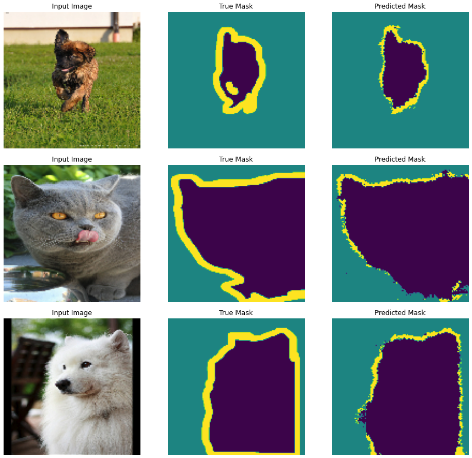

# Image Segmentation

Image Segmentation using [U-Net](https://arxiv.org/abs/1505.04597) model trained on [Oxford-IIIT Pet Dataset](https://www.robots.ox.ac.uk/~vgg/data/pets/) to segment pets.

As part of the U-net model, we use a pretrained MobileNetV2 model (to reduce training cost) for the encoder, and a sequential network of upsample blocks from pix2pix as the decoder.

After training for 20 epochs, our model can generate segmentation mask estimates reliably, as shown for a few examples below:

### References
- [U-Net: Convolutional Networks for Biomedical Image Segmentation](https://arxiv.org/abs/1505.04597)
- [Image-to-Image Translation with Conditional Adversarial Networks](https://arxiv.org/abs/1611.07004)
- [MobileNets: Efficient Convolutional Neural Networks for Mobile Vision Applications](https://arxiv.org/abs/1704.04861)
- [Oxford-IIIT Pet Dataset](https://www.robots.ox.ac.uk/~vgg/data/pets/)
